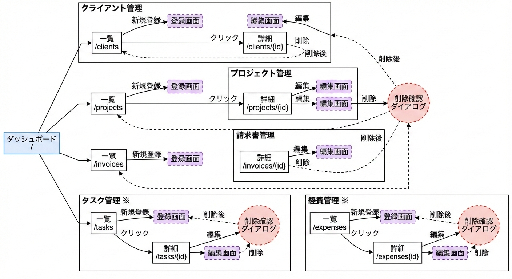

# 画面遷移図

## 主要画面一覧

### 1.ダッシュボード（トップ画面）
- パス：'/'
- 表示内容：
  - 進行中のプロジェクト数
  - 未払い請求書の合計
  - 今月の収支サマリー
  - 期限が近いタスク
- 遷移先:
  - プロジェクト一覧へ
  - クライアント一覧へ
  - 請求書一覧へ

### 2. クライアント一覧
- パス: `/clients`
- 表示内容: クライアントリスト
- アクション:
  - 新規登録ボタン → クライアント登録画面
  - クライアント名クリック → クライアント詳細画面

### 3. クライアント詳細
- パス: `/clients/{id}`
- 表示内容:
  - クライアント情報
  - 関連プロジェクト一覧
- アクション:
  - 編集ボタン → クライアント編集画面
  - 削除ボタン → 確認ダイアログ → 一覧に戻る

（以下、プロジェクト、請求書、タスク、経費も同様）
